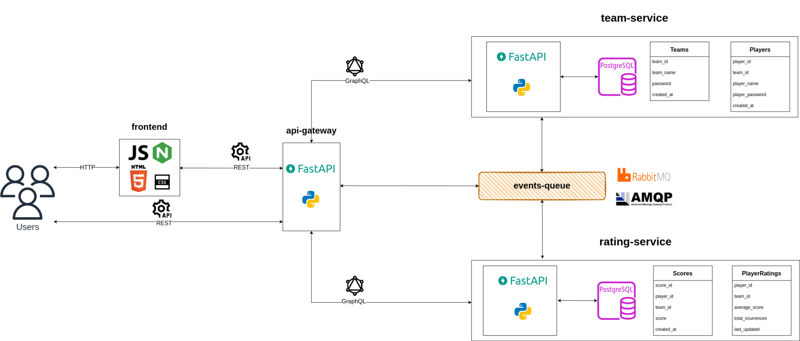

# ZUIDUI

## Abstract

The ZUIDUI project aims to apply the technologies and methodologies taught during the Master's course to develop a complete application based on microservices.  
The main functionalities include player and team registration, a 360-degree scoring system, and an information consolidation interface. Its architecture uses microservices, event-driven communication, and solid software development practices to ensure it’s scalable, maintainable, and resilient.

## Architecture

The application is built with several independent microservices, each with its own database to keep data safe and separate. Here are the key components:

- **API Gateway**: Serves as the entry point for client requests, translating REST requests into GraphQL queries for microservices.
- **Team and Player Management Service**: Handles the creation and management of teams and players.
- **Rating Service**: Manages player ratings, allowing them to score each other for comprehensive performance evaluation.
- **Message Broker (RabbitMQ)**: Facilitates asynchronous communication between microservices using a fanout exchange.

### Application Architecture

### System Architecture

### Repositories and microservices

The project is organized as a GitHub organization with multiple repositories to facilitate collaboration and centralized management. Each repository contains technical details and deployment guides:

**[Frontend Repository](https://github.com/zuidui/frontend)**  
Hosts an Nginx server serving static files and the client-side code.

**[Resource Repository](https://github.com/zuidui/resources)**  
Contains Kubernetes manifests for common application resources like RabbitMQ and pgAdmin.

**[API Gateway Repository](https://github.com/zuidui/api-gateway)**  
Houses the FastAPI service that acts as the cluster's entry point, orchestrating requests and serving as a REST-GraphQL gateway.

**[Team and Player Management Service Repository](https://github.com/zuidui/team-service)**  
Contains the FastAPI service for creating and managing teams and players.

**[Rating Service Repository](https://github.com/zuidui/rating-service)**  
Includes the FastAPI service for player ratings.

**[Infrastructure Repository](https://github.com/zuidui/infrastructure)**  
Holds Kubernetes manifests and Infrastructure as Code (IaC) resources for deployment.

**[Documentation Repository](https://github.com/zuidui/doc)**  
Project documentation.

### User cases

#### Register a team and players

#### Join a team and rate players

## Data Persistence

Each microservice has its own database to ensure data independence and modularity. PostgreSQL is used for the main services, and a common pgAdmin instance is deployed for database management.

## Development Environments

The project operates in two environments: PRE (preproduction) and PRO (production). A Kubernetes cluster manages the environments, with Minikube used for local development and Amazon EKS for production.

## Continuous Integration and Continuous Deployment (CI/CD)

The CI/CD pipeline is implemented using GitHub Actions for integration and ArgoCD for continuous deployment, adhering to GitOps principles.

## Development and Design Guidelines

The development follows best practices including:

- **Framework**: FastAPI for service development.
- **Messaging**: RabbitMQ for inter-service communication.
- **Testing**: Test-driven development with unit and integration tests.
- **Containers**: Development containers for consistency.
- **Methodology**: GitHub Flow for source control and CI/CD.

## Future Improvements

- Implement administrative and balanced match generation services based on average scores.
- Add response caching with Redis to improve latency.
- Develop the frontend using modern frameworks like Angular or Vue.
- Implement the Saga pattern for transaction management.
- Expand the test pyramid to include end-to-end tests.
- Add contract testing to ensure inter-service interactions.
- Perform load testing with tools like Artillery.
- Integrate QA tools like SonarQube into the CI pipeline.
- Enhance cluster security and inter-service communication control with network policies.
- Improve observability in Kubernetes with Prometheus and Datadog for automatic rollbacks.
- Efficient node scaling with Karpenter.
- Support multi-cloud providers with Terraform.

## Contact

For any inquiries or issues, please open an issue on the [GitHub organization](https://github.com/zuidui) or contact any of the maintainers.
